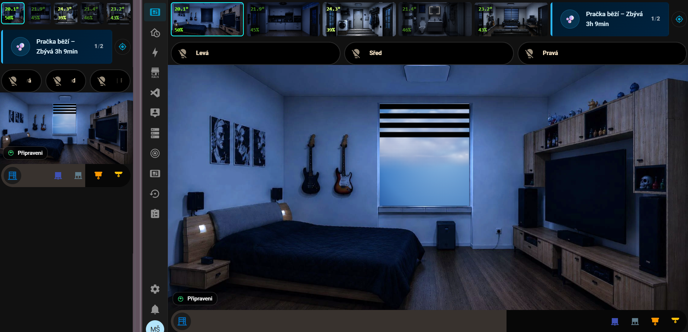
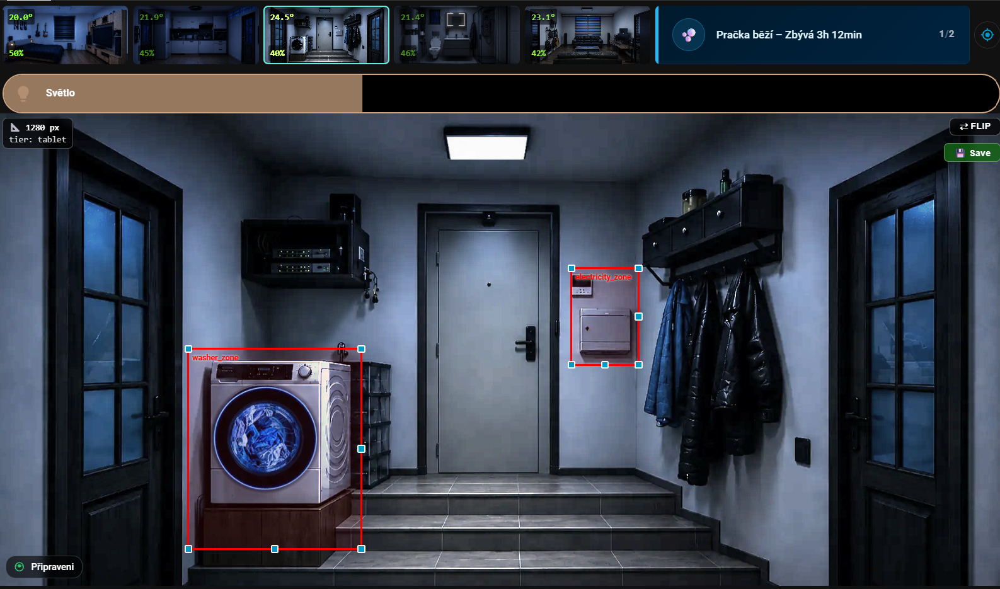

# Room Overlay Card

[](https://github.com/hacs/integration)
[](https://github.com/Michailjovic/Room-Card/releases/latest)
[](LICENSE)

A Home Assistant Lovelace card for **room visualization**. Take a photo of your room and bring it to life: dim it with the lights, place clickable controls on the furniture, show live sensor values, animate the blinds, and embed any other HA card on top of it.

**One card adapts to every screen** — phone, tablet, desktop and ultrawide — so you don't have to build and maintain a separate card per device. Everything is configurable from a full tabbed GUI editor; you can build a whole card by dragging elements onto the image, no YAML required.


---

## Features at a glance

| Feature | What it does |
|---|---|
| **Responsive tiers** | One card adapts across mobile / tablet / desktop / ultrawide, driven by the card's own width |
| **Base image** | Any room photo, per-tier aspect ratio, configurable corner radius and max height |
| **CSS filter engine** | Brightness, saturation, sepia, blur… driven by entity states with smooth transitions |
| **Brightness model** | Multi-stop filter interpolation: define stops (day / night / cinema…) and blend automatically |
| **Overlay layers** | Transparent PNG layers with conditional opacity/filter; state-driven image switching |
| **Gauges** | Animated progress bars in 6 fill directions, color gradients, per-gauge visibility |
| **Blinds** | Roller, venetian slat, and day/night (zebra) blind animations driven by cover entities |
| **Clickable zones** | Invisible hit areas — navigate, more-info, toggle, call-service, browser-mod popup |
| **Slider zones** | Drag across a zone to dim lights, move covers, set volume/temperature |
| **Status badges** | Floating chips in any corner — MDI icon, conditional color, conditional label |
| **Icons & labels** | State-aware MDI icons and entity/template text values placed anywhere |
| **Embedded HA cards** | Any card (tile, mini-graph, button…) placed at absolute coordinates |
| **Companion cards** | Full HA cards stacked above / below the image (great for mobile) |
| **Camera & weather** | Live camera snapshot as the base layer; animated rain/snow overlay |
| **Multi-room** | One card for the whole home — define rooms, swipe & presence-follow |
| **Auto navigation menu** | The room switcher (thumbnails / tabs / dots) is generated automatically from your rooms — you never build the menu by hand |
| **Hold feedback** | A progress ring fills and turns green when a hold gesture registers |
| **Tabbed GUI editor** | Build everything visually — drag, resize, reorder — without writing YAML |

---

## Screenshots

| | |
|---|---|
|  |  |
| *One card, every screen — the same card at different widths* | *Tabbed GUI editor — build it without YAML* |
|  |  |
| *Day scene — full brightness* | *Night mode — dim filter active* |
|  |  |
| *Gauges — temperature, humidity, CO₂* | *Day/night zebra blind at 60 %* |
|  | |
| *Test mode — click to select, drag to position* | |

> **Screenshots to capture** for v2.0.0 (drop the files into `screenshots/`):
> `hero.png` (finished card, shown at the top), `responsive.png` (the same card at two widths side by side — the headline feature), `editor.png` (the tabbed editor), `day.png` / `night.png` (same room, brightness filter off/on), `gauges.png`, `blinds.png`, `testmode.png` (test mode with one element selected). Until a file exists, GitHub shows a broken-image icon for that slot.

---

## Installation

### Via HACS (recommended)

1. Open **HACS → Frontend → ⋮ → Custom repositories**
2. Add `https://github.com/Michailjovic/Room-Card` — type **Lovelace**
3. Search for **Room Overlay Card** → Install
4. Hard-refresh your browser (`Ctrl+Shift+R`)

### Manual

1. Download `room-overlay-card.js` from the [latest release](https://github.com/Michailjovic/Room-Card/releases/latest)
2. Copy to `/config/www/room-overlay-card.js`
3. **Settings → Dashboards → ⋮ → Manage resources** → add `/local/room-overlay-card.js` (type: JavaScript module)
4. Hard-refresh

---

## Quick start (no YAML)

1. **Add the card** to a dashboard — *Add card → Custom: Room Overlay Card*.
2. The editor opens on a single step: **set a background image** (a room photo or floor-plan, e.g. `/local/bedroom.webp`). The rest of the editor appears once it's set.
3. Turn on **Drag-edit preview** in the header. Now drag elements straight onto the image.
4. In the **Elements** tab, add an icon, label, zone or embedded card and drop it on the right spot.
5. Save. That's it — you never had to touch YAML.

The smallest possible card in YAML:

```yaml
type: custom:room-overlay-card
base_image: /local/images/bedroom.webp
aspect_ratio: "16/9"
```

---

## The editor

The GUI editor is organized into four tabs, with a persistent header on top.

**Header (always visible):** the **room picker** (when the card is multi-room — switches which room the Image and Elements tabs edit), **Test mode**, and **Drag-edit preview**.

- **Image** — the background (image or camera), image-swap conditions, weather overlay, CSS filters, the brightness model, filter transition and zoom. Also the **companion cards** (above/below the image).
- **Elements** — everything you place on the image: zones, icons, labels, badges, gauges, blinds, embedded cards, overlays, and groups. Each type is a collapsible section with a count.
- **Responsive** — the breakpoints and the per-tier image shape (see the next section).
- **Rooms & menu** — the room list (add / remove / reorder), presence-follow, and the navigation strip.

**Drag-edit preview** is a live, editable copy of the card shown inside the editor. You can drag and resize elements right there, and it shows the room picked in the header. (The preview panel Home Assistant shows on the right is its own — it follows live presence and won't track the room picker.)

**Test mode** (`test_mode: true`, or the header toggle) overlays editing affordances on the card: red outlines on zones, blue dashed outlines on embedded cards, and a live **width + active-tier badge** in the corner. **Click an element to select it** — only the selected element shows resize handles, so the card stays readable even with many overlapping elements. Drag to move (snaps to a 0.5 % grid, magnetic alignment guides, hold **Alt** for free movement), drag a handle to resize, or nudge the selection with the **arrow keys** (Shift = 0.1 %). Drag on an empty area to **draw a new zone**. The editor also has **undo/redo** (↶ ↷ or Ctrl+Z / Ctrl+Y).

---

## Responsive — one card, every screen

Instead of building a separate card for each device, this card resolves a **tier** from its own rendered width and applies per-tier settings on top of a shared base.

The four tiers and their default thresholds (each value is the exclusive upper bound; `ultrawide` is everything above the last):

| Tier | Default width |
|---|---|
| `mobile` | `< 600px` |
| `tablet` | `600 – 1024px` |
| `desktop` | `1024 – 1600px` |
| `ultrawide` | `≥ 1600px` |

> **Tiers follow the card's own width — its dashboard column — not the device's screen resolution.** A full-width card on a landscape tablet may be 1200px wide and therefore in the `desktop` tier. Turn on **Test mode** to read the live width and active tier on the card, then tune the thresholds.

Override the thresholds top-level (only the ones you set; the rest keep their defaults):

```yaml
breakpoints:
  mobile: 600
  tablet: 1024
  desktop: 1600
```

### Per-element tier overrides

Every element accepts `mobile:` / `tablet:` / `desktop:` / `ultrawide:` blocks. Each merges over the base element, so you only specify what differs on that tier:

```yaml
labels:
  - id: temp
    top: 10%
    left: 80%
    font_size: 2%
    mobile:    { top: 6%,  left: 70%, font_size: 4% }
    ultrawide: { top: 12%, left: 85%, font_size: 1.5% }
```

### Per-tier image shape

`aspect_ratio`, `border_radius` and `max_height` accept either a single value or a per-tier object. A missing tier falls back to the nearest defined one (smaller first).

```yaml
# Crop the image differently per device (full width, centered vertical crop):
aspect_ratio: { mobile: 4/3, tablet: 16/10, desktop: 16/9, ultrawide: 21/9 }
```

- **`aspect_ratio` per tier** is the cleanest way to **crop** the image to a different shape per device — full width, image trimmed top/bottom, element positions stay aligned within each tier.
- **`max_height`** caps the image height on wide screens and centers it (letterboxing the sides) so the image doesn't grow huge as the card gets wider. It keeps the aspect ratio, so `%` positions stay valid.

```yaml
max_height: { desktop: 70vh, ultrawide: 80vh }   # or a single value: max_height: 70vh
```

> **Backwards compatible.** Existing `mobile:` blocks and `mobile_breakpoint` keep working — `mobile_breakpoint` simply overrides the mobile threshold.

---

## Configuration reference

### Top-level

| Key | Type | Default | Description |
|---|---|---|---|
| `base_image` | string | **required**¹ | Path to the room photo |
| `base_camera` | string | — | Camera entity used as live background (¹makes `base_image` optional) |
| `camera_refresh` | number | `10` | Camera snapshot refresh interval in seconds |
| `base_image_conditions` | list | — | Swap the base image by entity state |
| `weather_overlay` | object/string | — | Animated rain/snow layer (`entity`, `effect`, `opacity`, `z_index`) |
| `aspect_ratio` | string / object | `16/9` | Card aspect ratio — single `width/height` or per-tier object |
| `border_radius` | string / object | `12px` | Card corner radius — single value or per-tier object |
| `max_height` | string / object | — | Cap & center the image height on wide screens (e.g. `70vh`); per-tier object supported |
| `breakpoints` | object | `{mobile:600, tablet:1024, desktop:1600}` | Tier thresholds (px, exclusive upper bound) |
| `mobile_breakpoint` | number | `600` | Legacy — overrides the mobile threshold |
| `filter_transition` | string | `2s ease` | CSS transition for the base image filter |
| `filter_conditions` | list | `[]` | Discrete CSS filter states |
| `brightness_model` | object | — | Multi-stop filter interpolation |
| `overlays` | list | `[]` | Overlay image layers |
| `gauges` | list | `[]` | Progress gauge bars (linear or radial) |
| `blinds` | list | `[]` | Window blind visualizations |
| `zones` | list | `[]` | Clickable hit areas / sliders |
| `badges` | list | `[]` | Corner status chips |
| `icons` | list | `[]` | Icon overlays with actions |
| `labels` | list | `[]` | Value/template text labels |
| `elements` | list | `[]` | Embedded HA cards |
| `cards_above` / `cards_below` | list | `[]` | Companion HA cards stacked above/below the image |
| `groups` | list | `[]` | Client-side element groups (toggle/show/hide) |
| `rooms` | list | — | Multi-room definitions (see Multi-room) |
| `nav` | object | — | Multi-room navigation strip |
| `test_mode` | bool | `false` | Outlines, click-to-select, resize handles, Save button |
| `tap_action` | action | — | Action on card background click |
| `hold_feedback` | bool | `true` | Show the hold-gesture progress ring |
| `hold_color` | string | — | Color of the in-progress hold ring |
| `zoom` | bool | `false` | Pinch-zoom + pan (floorplan mode) |
| `parallax` | bool/object | — | Subtle tilt on pointer/device orientation |
| `haptic` | bool | `true` | Haptic feedback on actions (companion app) |

---

### Conditions

Used throughout the config to drive visual state.

```yaml
# Simple state match
entity: binary_sensor.window
state: "on"

# Negation
entity: light.bedroom
state_not: "unavailable"

# Numeric comparison  (operators: < > <= >= == !=)
entity: sensor.temperature
operator: ">"
value: 25

# AND / OR chaining
entity: sensor.temperature
operator: ">"
value: 22
and:
  entity: binary_sensor.night_mode
  state: "off"
```

---

### CSS filter engine

Apply conditional CSS filters to the base image.

```yaml
filter_conditions:
  - condition:
      entity: binary_sensor.night_mode
      state: "on"
    filter: brightness(0.3) saturate(0.2) sepia(0.4)
  - filter: brightness(1.0)    # default — no condition
```

---

### Brightness model

Define named filter stops and let the card interpolate smoothly between them based on a sensor value — continuous ambient-light simulation.

```yaml
brightness_model:
  source:
    - entity: sensor.living_room_lux
      min_input: 0
      max_input: 1000
  filter_gradient:
    - { value: 0,   filter: "brightness(0.3) saturate(0.5) sepia(0.3)" }
    - { value: 50,  filter: "brightness(1.0)" }
    - { value: 100, filter: "brightness(1.2) saturate(1.1)" }
```

The source value is normalized to 0–100 % and the matching `filter:` CSS string is interpolated across the stops. When set, the brightness model replaces `filter_conditions`. Use any CSS filter functions (`brightness`, `contrast`, `saturate`, `sepia`, `hue-rotate`, `blur`, `opacity`, `grayscale`, `invert`).

---

### Overlays

Transparent PNG layers stacked over the base image.

```yaml
overlays:
  # Conditional opacity
  - id: ceiling_light
    image: /local/images/bedroom_light_on.png
    transition: "1.5s ease"
    conditions:
      opacity:
        - condition: { entity: light.bedroom_ceiling, state: "on" }
          value: 1
        - value: 0      # default

  # State-driven image switching
  - id: fan_visual
    state_images:
      - { entity: fan.bedroom, state: "on", image: /local/images/fan_on.png }
      - { image: /local/images/fan_off.png }    # default
    conditions:
      opacity:
        - value: 1

  # Tint a glow PNG from a light's live color
  - id: rgb_strip
    image: /local/strip_glow.png
    color_from: light.tv_strip   # follows rgb_color / color_temp
```

---

### Gauges

Animated progress bars positioned anywhere on the card.

```yaml
gauges:
  - id: temperature_bar
    entity: sensor.bedroom_temperature
    top: "5%"
    left: "2%"
    width: "6%"
    height: "40%"
    min: 15
    max: 35
    orientation: vertical      # see table below
    background: "rgba(0,0,0,0.4)"
    border_radius: "4px"
    color_gradient:
      - { value: 15, color: "#2196F3" }   # blue — cold
      - { value: 22, color: "#4CAF50" }   # green — comfortable
      - { value: 30, color: "#FF5722" }   # red — hot
    visible_conditions: { entity: binary_sensor.show_gauges, state: "on" }
```

#### `orientation` values

| Value | Fill direction |
|---|---|
| `vertical` | bottom → top (default) |
| `top` | top → bottom |
| `horizontal` / `left` | left → right |
| `right` | right → left |
| `radial` | circular SVG arc gauge |

#### Radial gauges

```yaml
gauges:
  - id: humidity_ring
    entity: sensor.bedroom_humidity
    orientation: radial
    top: "8%"
    left: "80%"
    width: "14%"
    height: "24%"
    min: 0
    max: 100
    arc: 270          # arc length in degrees (default 270)
    thickness: 10     # stroke width in viewBox units
    target: 55        # optional target tick mark
    color_gradient:
      - { value: 30, color: "#FF9800" }
      - { value: 50, color: "#4CAF50" }
      - { value: 70, color: "#2196F3" }
```

Discrete color based on state (instead of a smooth gradient):

```yaml
color:
  - condition: { entity: sensor.co2, operator: ">", value: 1000 }
    value: "rgba(255,50,50,0.9)"
  - value: "rgba(100,200,100,0.8)"
```

---

### Blinds

Visualize window covers directly on the room image.

```yaml
blinds:
  - id: bedroom_blind
    entity: cover.bedroom_blind
    attribute: current_position   # omit to use entity state (open/closed)
    min: 0      # entity value = fully open
    max: 100    # entity value = fully closed
    top: "10%"
    left: "30%"
    width: "25%"
    height: "50%"
    z_index: 6
    blind_type: day_night         # roller | venetian | day_night
    slat_color: "rgba(0,0,0,0.85)"
    slat_count: 8
```

- **`roller`** — solid fill that grows from the top as the blind closes.
- **`venetian`** — horizontal slats with gaps (`slat_width`, `slat_gap`, `gap_color`).
- **`day_night`** — zebra / dual-layer blind; band pattern cycles `slat_count` times across the travel.

> **Inverted motor direction** — if your cover reports `0` = closed and `100` = open, swap: `min: 100`, `max: 0`.

---

### Clickable zones

Invisible hit areas over any part of the card.

```yaml
zones:
  - id: light_zone
    top: "55%"
    left: "8%"
    width: "20%"
    height: "18%"
    tap_action: { action: toggle, entity: light.bedroom }
```

#### Slider zones

Drag across a zone to control an entity. Domains: `light` (brightness), `cover` (position), `fan` (speed), `media_player` (volume), `climate` (temperature), `number` / `input_number`.

```yaml
zones:
  - id: dimmer
    top: "20%"
    left: "60%"
    width: "12%"
    height: "45%"
    slider:
      entity: light.bedroom_ceiling
      direction: vertical    # vertical | horizontal
      live: false            # true = send while dragging (throttled)
      color: "rgba(255,255,255,0.28)"
    tap_action: { action: toggle, entity: light.bedroom_ceiling }
```

#### Action types

| Action | Required params | Description |
|---|---|---|
| `navigate` | `path` | Navigate to a dashboard path |
| `url` | `url_path` | Open a URL (`new_tab: false` for same tab) |
| `more-info` | `entity` | Open entity more-info dialog |
| `toggle` | `entity` | Toggle entity on/off |
| `call-service` / `perform-action` | `service` / `perform_action` | Call any HA action; supports `data:` and `target:` |
| `browser-mod-popup` | `title`, `size`, `content` | Open a browser-mod popup |
| `toggle-group` / `show-group` / `hide-group` | `group` | Control element groups |
| `switch-room` / `next-room` / `prev-room` / `follow-room` | — / `room` | Multi-room navigation |
| `none` | — | Do nothing |

Any action may carry `confirmation: true` (or `confirmation: {text: "..."}`). A `hold_action` shows a **progress ring** while you press, which turns green the moment the hold registers.

```yaml
tap_action:
  action: perform-action
  perform_action: climate.set_temperature
  target: { entity_id: climate.bedroom }
  data: { temperature: 21.5 }
  confirmation: { text: Set bedroom to 21.5 °C? }
```

---

### Status badges

Floating chips anchored to card corners.

```yaml
badges:
  - id: temp_chip
    position: bottom-right    # top-left | top-right | bottom-left | bottom-right
    icon: mdi:thermometer
    icon_color:
      - condition: { entity: sensor.temperature, operator: ">", value: 26 }
        value: "orange"
      - value: "white"
    label:
      - condition: { entity: sensor.temperature, operator: ">", value: 26 }
        value: "Hot!"
      - value: "{{ states('sensor.temperature') | round(1) }} °C"
    visible: { entity: binary_sensor.someone_home, state: "on" }
    tap_action: { action: more-info, entity: sensor.temperature }
```

---

### Icons & labels

State-aware MDI icons and text values placed anywhere on the image.

```yaml
icons:
  - id: lamp
    icon: mdi:lamp
    top: "30%"
    left: "62%"
    size: "22px"            # % of card width also works (responsive)
    color:
      - condition: { entity: light.lamp, state: "on" }
        value: "#FFD54F"
      - value: "#888"
    tap_action: { action: toggle, entity: light.lamp }

labels:
  # Entity value with automatic unit
  - id: temp_label
    entity: sensor.bedroom_temperature
    top: "12%"
    left: "10%"
    decimals: 1
    suffix: auto           # appends the entity's unit_of_measurement
    font_size: "2.2%"      # % of card width — responsive
    color_gradient:
      - { value: 18, color: "#2196F3" }
      - { value: 26, color: "#FF5722" }

  # Jinja template (rendered live via WebSocket)
  - id: summary
    template: >-
      {{ states('sensor.bedroom_temperature') | round(1) }} °C ·
      {{ states('sensor.bedroom_humidity') | round(0) }} %
    top: "5%"
    left: "10%"

  # Relative time
  - id: last_motion
    entity: binary_sensor.bedroom_motion
    attribute: last_changed_ts
    format: relative         # "5 minutes ago", localized, refreshes every 30 s
    prefix: "Motion: "
```

---

### Embedded HA cards

Place any Lovelace card at absolute coordinates over the room image.

```yaml
elements:
  - id: temp_graph
    top: "3%"
    left: "65%"
    width: "32%"
    height: "22%"
    z_index: 4
    border_radius: "8px"
    overflow: hidden
    visible: { entity: binary_sensor.show_graph, state: "on" }
    card:
      type: custom:mini-graph-card
      entities: [sensor.bedroom_temperature]
      hours_to_show: 6
```

### Companion cards (above / below the image)

Stack full HA cards above or below the room image — handy on mobile where positioned overlays get cramped. Per room. Each entry is a card config, or `{card, height, media}`.

```yaml
cards_below:
  - type: entities
    entities: [light.bedroom_ceiling, fan.bedroom]
  - card: { type: thermostat, entity: climate.bedroom }
    height: 180px
    media: mobile          # all | mobile | tablet | desktop | ultrawide
```

In the GUI these live in the **Image** tab as *Cards above image* / *Cards below image* — paste a card config you built elsewhere.

---

### Camera background & weather effects

```yaml
type: custom:room-overlay-card
base_camera: camera.living_room      # base_image becomes optional
camera_refresh: 5                    # seconds (paused off-screen)
weather_overlay:
  entity: weather.home               # auto: rainy→rain, pouring→heavy rain,
                                     # snowy→snow, fog→fog, lightning-rainy→rain+flashes
  # effect: rain                     # manual: rain | rain-heavy | snow | snow-heavy | fog | lightning
  angle: 115deg                      # optional — tilt rain (wind)
  opacity: 0.45
```

---

### Template visibility

Any zone, icon, badge, overlay, embedded card, gauge or blind can be driven by a Jinja2 template (rendered live over WebSocket). `visible_template` takes precedence over `visible` / `visible_conditions`:

```yaml
zones:
  - id: tv_zone
    visible_template: "{{ is_state('media_player.tv', 'on') and now().hour >= 18 }}"

badges:
  - id: power_chip
    icon: mdi:flash
    label_template: "{{ states('sensor.power') | round(0) }} W"
```

---

### Groups (pop-up control panels)

Bundle several elements under a named group and show/hide them together — e.g. a control panel that appears when you tap an icon. Each element gets `group: <name>`; the `groups:` section defines the panel's background/position and default visibility; actions (`toggle-group` / `show-group` / `hide-group`) flip it.

```yaml
icons:
  - id: open_panel
    icon: mdi:tune
    top: 80%
    left: 90%
    tap_action: { action: toggle-group, group: controls }

groups:
  - id: controls
    visible: false
    style: { top: 60%, left: 60%, width: 38%, height: 35%, background: "rgba(0,0,0,0.6)", border_radius: 12px }

elements:
  - id: light_tile
    group: controls
    top: 62%
    left: 62%
    width: 34%
    height: 14%
    card: { type: tile, entity: light.bedroom }
```

---

## Multi-room (one card = whole home)

Define your rooms and the card **builds the navigation menu for you automatically** — you don't lay out a single button. From the `rooms:` list it generates a switcher in the style you pick (`thumbnails`, `tabs`, `dots`, or `none`): the thumbnails are live, filtered copies of each room (so a dimmed room looks dimmed in the menu too), and you can drop `{room}` chips on them to show each room's temperature, humidity, etc. Position it top, bottom, a side rail on ultrawide, or let it choose with `position: auto`.

```yaml
type: custom:room-overlay-card
aspect_ratio: "16/9"            # card-level keys are shared by all rooms
card_id: flat_main              # pairing key (editor/save matching)
room_entity:                    # string, or per-device mapping:
  default: sensor.phone_alice_area       # Bermuda area sensor / input_select
  by_user:                      # logged-in HA user (case-insensitive)
    Alice: sensor.phone_alice_area
  by_browser:                   # browser_mod browser ID (wall tablets)
    wall_tablet_living: sensor.phone_alice_area
follow_hold: 60                 # s — manual navigation outranks presence
follow_mode: always             # always | initial (only on load) | manual (button only)
room_state_entity: input_text.active_room   # card mirrors the active room here
url_sync: true                  # opt-in: keep the active room in the URL → #room=<id>
nav:
  style: thumbnails             # thumbnails | tabs | dots | none
  position: auto                # top | bottom | left | right | auto
  auto_breakpoint: 1100         # auto: side rail above this card width (ultrawide)
  height: 64px
  live: composite               # thumbnails become MINI-ROOMS: base + active overlays + filters
  chips:                        # {room} → room id; per-room `chips:` overrides
    - { entity: sensor.{room}_temperature, decimals: 1, suffix: "°" }
rooms:
  - id: livingroom
    name: Obývák
    icon: mdi:sofa              # only shown when nav style = tabs
    base_image: /local/livingroom.webp
    area_match: [Living room]   # states of room_entity mapping here
    zones:
      - id: door_bedroom        # a door as a portal to another room
        top: "30%"
        left: "70%"
        width: "10%"
        height: "40%"
        tap_action: { action: switch-room, room: bedroom }
  - id: bedroom
    name: Bedroom
    base_image: /local/bedroom.webp
    area_match: [Bedroom, Ložnice]
```

With **`nav.live: composite`** every thumbnail becomes a **live mini-room**: it stacks the room's currently *active* overlay images (lit lamps, open windows, …) over its base image, applies the room's conditional base image and its `filter_conditions` / `brightness_model` filter — so the menu really is a scaled-down copy of each room's current look, updating live. It's pure CSS background compositing (no extra card instances or subscriptions), with two approximations: an overlay shows whenever its opacity resolves above 0, and grouped (pop-up panel) or `visible_template`-driven overlays are skipped.

Switching works several ways: nav thumbnails/tabs, the **follow button** (crosshair that lights up when you're away from your presence room; `{action: follow-room}`), **finger-attached swipe** (the room follows your finger; release past 25 % or fling to commit), **mouse-wheel** on desktop (`nav.wheel: horizontal | vertical | both`), the `switch-room` / `next-room` / `prev-room` actions, and automatic **presence follow** via `room_entity`. With **`url_sync: true`** the active room is written to the page URL as `#room=<id>` (set `url_sync: <key>` for a custom hash key), so rooms become **bookmarkable and shareable** — opening a `#room=bedroom` link jumps straight there, and browser back/forward navigates rooms. Updates, templates and camera refresh run only for the active room. Top-level room-scoped keys act as defaults for every room. Without `rooms:` the card behaves as a single room; the editor has a one-click **Convert to multi-room** button, and you can **reorder rooms** with the ▲▼ buttons in the *Rooms & menu* tab.

---

## Complete example

```yaml
type: custom:room-overlay-card
base_image: /local/images/bedroom.webp
aspect_ratio: { mobile: 4/3, desktop: 16/9, ultrawide: 21/9 }
max_height: { desktop: 70vh, ultrawide: 80vh }
border_radius: "12px"

filter_conditions:
  - condition: { entity: binary_sensor.night_mode, state: "on" }
    filter: brightness(0.25) saturate(0.1) sepia(0.3)
  - filter: brightness(1.0)

overlays:
  - id: ceiling_light
    image: /local/images/bedroom_ceiling_on.png
    transition: "1.5s ease"
    conditions:
      opacity:
        - condition: { entity: light.bedroom_ceiling, state: "on" }
          value: 1
        - value: 0

gauges:
  - id: temp_gauge
    entity: sensor.bedroom_temperature
    top: "5%"
    left: "2%"
    width: "5%"
    height: "35%"
    min: 16
    max: 30
    color_gradient:
      - { value: 16, color: "#2196F3" }
      - { value: 22, color: "#4CAF50" }
      - { value: 30, color: "#FF5722" }

zones:
  - id: ceiling_switch
    top: "55%"
    left: "8%"
    width: "18%"
    height: "20%"
    tap_action: { action: toggle, entity: light.bedroom_ceiling }
    hold_action: { action: more-info, entity: light.bedroom_ceiling }

badges:
  - id: humidity
    position: bottom-left
    icon: mdi:water-percent
    label:
      - value: "{{ states('sensor.bedroom_humidity') | round(0) }} %"
    tap_action: { action: more-info, entity: sensor.bedroom_humidity }
```

See **[PRESETS.md](PRESETS.md)** for a gallery of copy-paste recipes (day/night filters, weather moods, dimmer zones, door portals, Bermuda presence multiroom…).

---

## Positioning tips

All `top`, `left`, `width`, `height` values are percentage strings relative to the card. Enable **Test mode** to position by eye: click an element to select it, drag to move (snaps to 0.5 %, Alt = free), drag handles to resize, arrow keys to nudge, or draw a new zone on an empty area. The live width/tier badge helps you tune `breakpoints` per device.

---

## Development

`room-overlay-card.js` is the single source of truth — hand-maintained vanilla JS, no build step, zero external runtime dependencies. Edit the file directly and hard-refresh your browser. A small smoke-test suite lives in `tests/` (`node tests/smoke.test.js`).

---

## License

MIT © 2025–2026 Michailjovic
