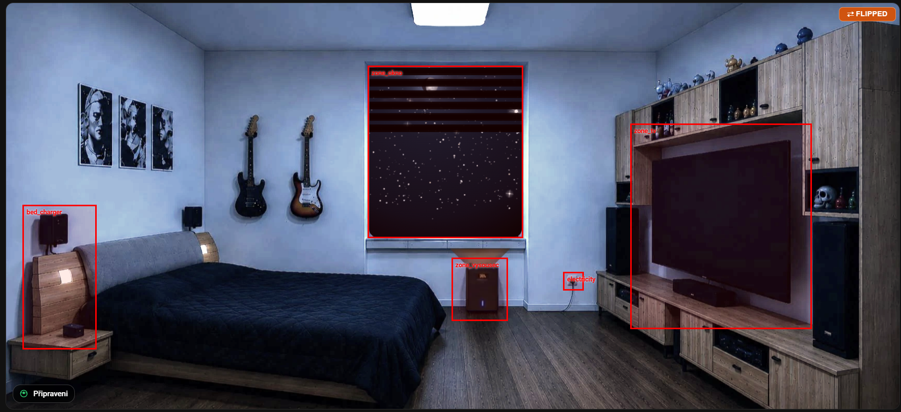
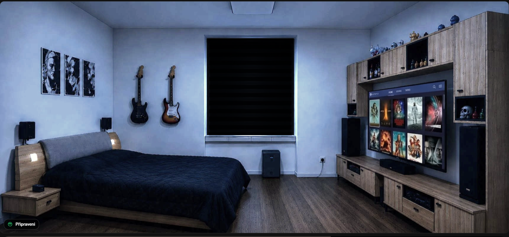
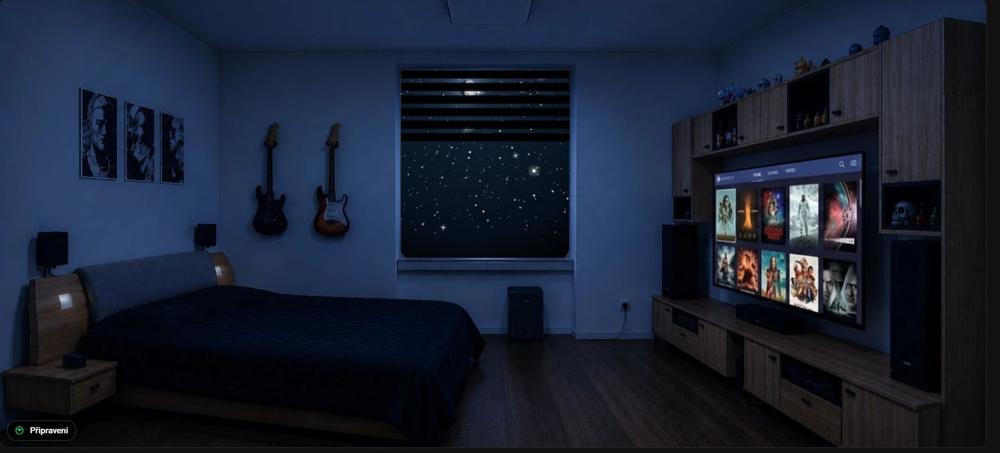
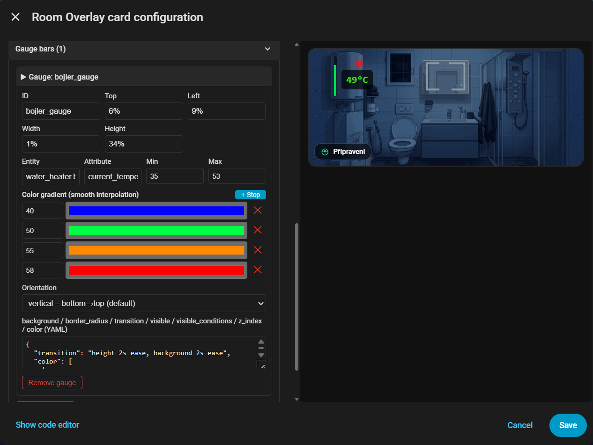
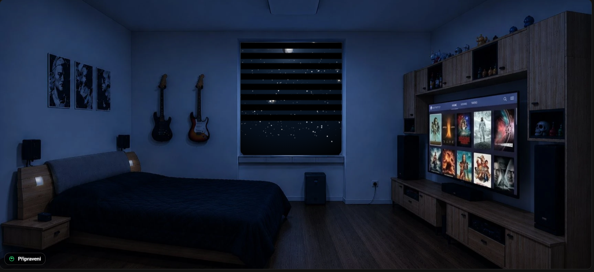
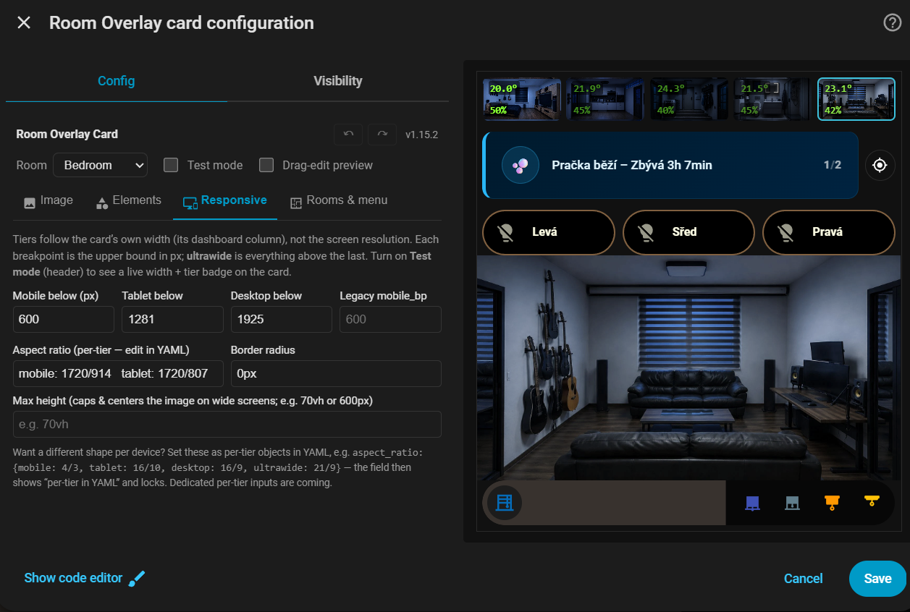

# Room Overlay Card

[](https://github.com/hacs/integration)
[](https://github.com/Michailjovic/Room-Card/releases/latest)
[](LICENSE)

A Home Assistant Lovelace card for **room visualization** — place a photo of your room and bring it to life with conditional CSS filters, transparent overlay layers, clickable zones, status badges, progress gauges, animated window blinds, and embedded HA cards. Everything configurable from a full GUI editor — no YAML required.



---

## Features at a glance

| Feature | What it does |
|---|---|
| **Base image** | Any room photo, any aspect ratio, configurable border-radius |
| **CSS filter engine** | Brightness, saturation, sepia, blur… driven by entity states with smooth transitions |
| **Brightness model** | Multi-stop filter interpolation: define named stops (day / night / cinema…) and blend automatically |
| **Overlay layers** | Transparent PNG layers with conditional opacity/filter; state-driven image switching |
| **Gauges** | Animated progress bars in 6 fill directions, color gradients, per-gauge visibility conditions |
| **Blinds** | Roller, venetian slat, and day/night (zebra) blind animations driven by cover entities |
| **Clickable zones** | Invisible hit areas — navigate, more-info, toggle, call-service, browser-mod popup |
| **Status badges** | Floating chips in any corner — MDI icon, conditional color, conditional label |
| **Embedded HA cards** | Any card (tile, mini-graph, button…) placed at absolute coordinates |
| **Slider zones** | Drag across a zone to dim lights, move covers, set volume/temperature |
| **Radial gauges** | Circular SVG arc gauges with gradients and target markers |
| **Jinja templates** | Labels rendered from any Jinja2 template, live via WebSocket |
| **Camera background** | Use a camera snapshot as the base layer, auto-refreshing |
| **Weather effects** | Animated rain/snow overlay driven by a weather entity |
| **Groups** | Show/hide sets of elements with fade, mutual exclusion via grouping codes |
| **Test mode** | Red outlines on zones, blue on elements — drag & drop, resize, keyboard nudge |
| **GUI editor** | Full configuration without writing YAML, reorder buttons, live highlight |

---

## Screenshots

| | |
|---|---|
|  |  |
| *Day scene — full brightness* | *Night mode — dim filter active* |
|  |  |
| *Gauges — temperature, humidity, CO₂* | *Day/night zebra blind at 60 %* |
|  | |
| *GUI editor — no YAML needed* | |

---

## Installation

### Via HACS (recommended)

1. Open **HACS → Frontend → ⋮ → Custom repositories**
2. Add `https://github.com/Michailjovic/Room-Card` — type **Lovelace**
3. Search for **Room Overlay Card** → Install
4. Hard-refresh your browser (`Ctrl+Shift+R`)

### Manual

1. Download `room-overlay-card.js` from the [latest release](https://github.com/Michailjovic/Room-Card/releases/latest)
2. Copy to `/config/www/room-overlay-card.js`
3. **Settings → Dashboards → ⋮ → Manage resources** → add `/local/room-overlay-card.js` (type: JavaScript module)
4. Hard-refresh

---

## Minimal configuration

```yaml
type: custom:room-overlay-card
base_image: /local/images/bedroom.webp
aspect_ratio: "16/9"
```

---

## Configuration reference

### Top-level

| Key | Type | Default | Description |
|---|---|---|---|
| `base_image` | string | **required**¹ | Path to the room photo |
| `base_camera` | string | — | Camera entity used as live background (¹makes `base_image` optional) |
| `camera_refresh` | number | `10` | Camera snapshot refresh interval in seconds |
| `base_image_conditions` | list | — | Swap the base image by entity state |
| `weather_overlay` | object/string | — | Animated rain/snow layer (`entity`, `effect`, `opacity`, `z_index`) |
| `aspect_ratio` | string | `16/9` | Card aspect ratio (`width/height`) |
| `border_radius` | string | `12px` | Card corner radius |
| `filter_transition` | string | `2s ease` | CSS transition for the base image filter |
| `filter_conditions` | list | `[]` | Discrete CSS filter states |
| `brightness_model` | object | — | Multi-stop filter interpolation |
| `overlays` | list | `[]` | Overlay image layers |
| `gauges` | list | `[]` | Progress gauge bars (linear or radial) |
| `blinds` | list | `[]` | Window blind visualizations |
| `zones` | list | `[]` | Clickable hit areas / sliders |
| `badges` | list | `[]` | Corner status chips |
| `icons` | list | `[]` | Icon overlays with actions |
| `labels` | list | `[]` | Value/template text labels |
| `elements` | list | `[]` | Embedded HA cards |
| `groups` | list | `[]` | Client-side element groups (toggle/show/hide) |
| `test_mode` | bool | `false` | Outlines, drag & drop, resize handles, Save button |
| `tap_action` | action | — | Action on card background click |
| `haptic` | bool | `true` | Haptic feedback on actions (companion app) |

---

### Conditions

Used throughout the config to drive visual state.

```yaml
# Simple state match
entity: binary_sensor.window
state: "on"

# Negation
entity: light.bedroom
state_not: "unavailable"

# Numeric comparison  (operators: < > <= >= == !=)
entity: sensor.temperature
operator: ">"
value: 25

# AND / OR chaining
entity: sensor.temperature
operator: ">"
value: 22
and:
  entity: binary_sensor.night_mode
  state: "off"
```

---

### CSS filter engine

Apply conditional CSS filters to the base image.

```yaml
filter_conditions:
  - condition:
      entity: binary_sensor.night_mode
      state: "on"
    filter: brightness(0.3) saturate(0.2) sepia(0.4)
  - filter: brightness(1.0)    # default — no condition
```

---

### Brightness model

Define named filter stops and let the card interpolate smoothly between them based on a sensor value. Useful for continuous ambient light simulation.

```yaml
brightness_model:
  sources:
    - entity: sensor.living_room_lux
      min_input: 0
      max_input: 1000
  stops:
    - name: dark
      value: 0
      filters:
        brightness: 0.3
        saturate: 0.5
        sepia: 0.3
    - name: normal
      value: 50
      filters:
        brightness: 1.0
        saturate: 1.0
        sepia: 0.0
    - name: bright
      value: 100
      filters:
        brightness: 1.2
        saturate: 1.1
```

Supported filter keys: `brightness`, `contrast`, `saturate`, `sepia`, `hue-rotate`, `blur`, `opacity`, `grayscale`, `invert`.

---

### Overlays

Transparent PNG layers stacked over the base image.

```yaml
overlays:
  # Conditional opacity
  - id: ceiling_light
    image: /local/images/bedroom_light_on.png
    transition: "1.5s ease"
    conditions:
      opacity:
        - condition:
            entity: light.bedroom_ceiling
            state: "on"
          value: 1
        - value: 0      # default

  # State-driven image switching
  - id: fan_visual
    state_images:
      - entity: fan.bedroom
        state: "on"
        image: /local/images/fan_on.png
      - image: /local/images/fan_off.png    # default
    conditions:
      opacity:
        - value: 1
```

---

### Gauges

Animated progress bars positioned anywhere on the card.

```yaml
gauges:
  - id: temperature_bar
    entity: sensor.bedroom_temperature
    top: "5%"
    left: "2%"
    width: "6%"
    height: "40%"
    min: 15
    max: 35
    orientation: vertical      # see table below
    background: "rgba(0,0,0,0.4)"
    border_radius: "4px"
    transition: "height 1s ease"
    color_gradient:
      - value: 15
        color: "#2196F3"    # blue — cold
      - value: 22
        color: "#4CAF50"    # green — comfortable
      - value: 30
        color: "#FF5722"    # red — hot
    visible_conditions:
      entity: binary_sensor.show_gauges
      state: "on"
```

#### `orientation` values

| Value | Fill direction |
|---|---|
| `vertical` | bottom → top (default) |
| `top` | top → bottom |
| `horizontal` / `left` | left → right |
| `right` | right → left |
| `radial` | circular SVG arc gauge |

#### Radial gauges

```yaml
gauges:
  - id: humidity_ring
    entity: sensor.bedroom_humidity
    orientation: radial
    top: "8%"
    left: "80%"
    width: "14%"
    height: "24%"
    min: 0
    max: 100
    arc: 270          # arc length in degrees (default 270)
    thickness: 10     # stroke width in viewBox units
    target: 55        # optional target tick mark
    color_gradient:
      - value: 30
        color: "#FF9800"
      - value: 50
        color: "#4CAF50"
      - value: 70
        color: "#2196F3"
```

#### Discrete color based on state

```yaml
color:
  - condition:
      entity: sensor.co2
      operator: ">"
      value: 1000
    value: "rgba(255,50,50,0.9)"
  - value: "rgba(100,200,100,0.8)"
```

---

### Blinds

Visualize window covers directly on the room image.

```yaml
blinds:
  - id: bedroom_blind
    entity: cover.bedroom_blind
    attribute: current_position   # omit to use entity state (open/closed)
    min: 0      # entity value = fully open
    max: 100    # entity value = fully closed
    top: "10%"
    left: "30%"
    width: "25%"
    height: "50%"
    z_index: 6
    blind_type: day_night         # roller | venetian | day_night
    slat_color: "rgba(0,0,0,0.85)"
    slat_count: 8
```

#### Blind types

**`roller`** — solid fill that grows from the top as the blind closes.

```yaml
blind_type: roller
slat_color: "rgba(80,60,40,0.9)"
```

**`venetian`** — horizontal slats with visible gaps between them.

```yaml
blind_type: venetian
slat_color: "rgba(200,180,150,0.9)"
slat_width: 8     # px — slat thickness
slat_gap: 4       # px — gap between slats
gap_color: "rgba(180,160,140,0.35)"
```

**`day_night`** — zebra / dual-layer fabric blind. Two CSS gradient layers animate an authentic rolling-band open/close transition. The band pattern cycles `slat_count` times as the blind travels from fully open to fully closed.

```yaml
blind_type: day_night
slat_color: "rgba(0,0,0,0.9)"
slat_count: 8     # number of band pairs — controls density and animation speed
```

> **Inverted motor direction** — if your cover reports `0` = closed and `100` = open, swap the values: `min: 100` and `max: 0`. The card handles it automatically.

---

### Clickable zones

Invisible hit areas over any part of the card.

```yaml
zones:
  - id: light_zone
    top: "55%"
    left: "8%"
    width: "20%"
    height: "18%"
    tap_action:
      action: toggle
      entity: light.bedroom

  # Conditional action
  - id: smart_zone
    top: "70%"
    left: "5%"
    width: "15%"
    height: "12%"
    tap_action:
      condition:
        entity: input_boolean.guest_mode
        state: "on"
      then:
        action: navigate
        path: /lovelace/guest
      else:
        action: toggle
        entity: light.bedroom_main
```

#### Slider zones

Drag across a zone to control an entity — vertical by default, horizontal optional.
Domains: `light` (brightness), `cover` (position), `fan` (speed), `media_player`
(volume), `climate` (temperature, uses `min`/`max`), `number` / `input_number`.

```yaml
zones:
  - id: dimmer
    top: "20%"
    left: "60%"
    width: "12%"
    height: "45%"
    slider:
      entity: light.bedroom_ceiling
      direction: vertical    # vertical | horizontal
      live: false            # true = send while dragging (throttled)
      color: "rgba(255,255,255,0.28)"
    tap_action:              # tap still works — drags are suppressed
      action: toggle
      entity: light.bedroom_ceiling
```

#### Action types

| Action | Required params | Description |
|---|---|---|
| `navigate` | `path` | Navigate to a dashboard path |
| `url` | `url_path` | Open a URL (`new_tab: false` for same tab) |
| `more-info` | `entity` | Open entity more-info dialog |
| `toggle` | `entity` | Toggle entity on/off |
| `call-service` / `perform-action` | `service` or `perform_action` | Call any HA action; supports `data:` and `target:` |
| `browser-mod-popup` | `title`, `size`, `content` | Open a browser-mod popup |
| `toggle-group` / `show-group` / `hide-group` | `group` | Control element groups |
| `none` | — | Do nothing |

Any action may carry `confirmation: true` (or `confirmation: {text: "..."}`)
to ask before executing. Actions trigger haptic feedback in the companion app
unless `haptic: false` is set at card level.

```yaml
tap_action:
  action: perform-action
  perform_action: climate.set_temperature
  target:
    entity_id: climate.bedroom
  data:
    temperature: 21.5
  confirmation:
    text: Set bedroom to 21.5 °C?
```

---

### Status badges

Floating chips anchored to card corners.

```yaml
badges:
  - id: temp_chip
    position: bottom-right    # top-left | top-right | bottom-left | bottom-right
    icon: mdi:thermometer
    icon_color:
      - condition:
          entity: sensor.temperature
          operator: ">"
          value: 26
        value: "orange"
      - value: "white"
    label:
      - condition:
          entity: sensor.temperature
          operator: ">"
          value: 26
        value: "Hot!"
      - value: "{{ states('sensor.temperature') | round(1) }} °C"
    visible:
      entity: binary_sensor.someone_home
      state: "on"
    tap_action:
      action: more-info
      entity: sensor.temperature
```

---

### Embedded HA cards

Place any Lovelace card at absolute coordinates over the room image.

```yaml
elements:
  - id: temp_graph
    top: "3%"
    left: "65%"
    width: "32%"
    height: "22%"
    z_index: 4
    border_radius: "8px"
    overflow: hidden
    visible:
      entity: binary_sensor.show_graph
      state: "on"
    card:
      type: custom:mini-graph-card
      entities:
        - sensor.bedroom_temperature
      hours_to_show: 6
      line_width: 2
      show:
        labels: false
        icon: false

  - id: weather_tile
    top: "75%"
    left: "68%"
    width: "30%"
    height: "22%"
    card:
      type: tile
      entity: weather.home
```

---

### Labels

Text values positioned anywhere on the card — entity states or Jinja templates.

```yaml
labels:
  # Entity value with automatic unit
  - id: temp_label
    entity: sensor.bedroom_temperature
    top: "12%"
    left: "10%"
    decimals: 1
    suffix: auto          # appends the entity's unit_of_measurement
    font_size: "2.2%"     # % of card width — responsive
    color_gradient:
      - value: 18
        color: "#2196F3"
      - value: 26
        color: "#FF5722"

  # Jinja template (rendered live via WebSocket)
  - id: summary
    template: >-
      {{ states('sensor.bedroom_temperature') | round(1) }} °C ·
      {{ states('sensor.bedroom_humidity') | round(0) }} %
    top: "5%"
    left: "10%"
```

---

### Camera background & weather effects

```yaml
type: custom:room-overlay-card
base_camera: camera.living_room      # base_image becomes optional
camera_refresh: 5                    # seconds (paused off-screen)
weather_overlay:
  entity: weather.home               # auto: rainy→rain, pouring→heavy rain,
                                     # snowy→snow, hail→heavy snow, fog→fog,
                                     # lightning-rainy→rain+flashes
  # effect: rain                     # manual: rain | rain-heavy | snow |
                                     #         snow-heavy | fog | lightning
  angle: 115deg                      # optional — tilt rain (wind)
  opacity: 0.45
  z_index: 5
```

---

### Template visibility & relative time

Any zone, icon, badge, overlay, embedded card, gauge or blind can be driven by
a Jinja2 template (rendered live over WebSocket). `visible_template` takes
precedence over `visible` / `visible_conditions`:

```yaml
zones:
  - id: tv_zone
    visible_template: "{{ is_state('media_player.tv', 'on') and now().hour >= 18 }}"
    ...

badges:
  - id: power_chip
    icon: mdi:flash
    label_template: "{{ states('sensor.power') | round(0) }} W"

labels:
  - id: last_motion
    entity: binary_sensor.bedroom_motion
    attribute: last_changed_ts        # or any timestamp state/attribute
    format: relative                  # "5 minutes ago", localized, 30 s refresh
    prefix: "Motion: "
```

---

### Mobile profiles, zoom & animations

```yaml
type: custom:room-overlay-card
mobile_breakpoint: 600        # mobile: overrides apply below this card width
zoom: true                    # pinch-zoom + pan (double-tap reset, Ctrl+wheel)

icons:
  - id: lamp
    top: "30%"
    left: "62%"
    size: "22px"
    fade: true                # fade in/out on visibility change
    slide: up                 # optional directional slide (implies fade)
    mobile:                   # alternative layout on phones
      top: "20%"
      left: "70%"
      size: "30px"

gauges:
  - id: temp_ring
    orientation: radial
    entity: sensor.temp
    tap_action:               # gauges & labels are now clickable
      action: more-info
      entity: sensor.temp

overlays:
  - id: rgb_strip
    image: /local/strip_glow.png
    color_from: light.tv_strip   # tint follows the light's rgb_color / color_temp
```

In test mode, **drag on an empty area** of the card to draw a new zone at that
exact spot (rubber-band rectangle, auto-named, synced into the editor).

---

### Multi-room (one card = whole home)

```yaml
type: custom:room-overlay-card
aspect_ratio: "16/9"            # card-level keys are shared by all rooms
card_id: flat_main              # pairing key (editor/save matching)
room_entity:                    # string, or per-device mapping:
  default: sensor.phone_alice_area       # Bermuda area sensor / input_select
  by_user:                      # logged-in HA user (case-insensitive)
    Alice: sensor.phone_alice_area
    Bob: sensor.phone_bob_area
  by_browser:                   # browser_mod browser ID (wall tablets)
    wall_tablet_living: sensor.phone_alice_area
follow_hold: 60                 # s — manual navigation outranks presence
follow_mode: always             # always | initial (only on load) | manual (button only)
room_state_entity: input_text.active_room   # card mirrors the active room here
                                # (input_text/input_select; per-device mapping supported)
nav:
  style: thumbnails             # thumbnails | tabs | dots | none
  position: auto                # top | bottom | left | right | auto
  auto_breakpoint: 1100         # auto: side rail above this card width (ultrawide)
  height: 64px
  width: auto                   # css size | auto = stretch items across the strip
  cards:                        # custom HA cards inside the strip (optional)
    - width: 38%
      card: {type: markdown, content: "💧 Vlhkost: {{ states('sensor.livingroom_humidity') }} %"}
  chips:                        # {room} → room id; per-room `chips:` overrides
    - entity: sensor.{room}_temperature
      decimals: 1
      suffix: "°"
      background: "rgba(0,0,0,0.55)"   # optional pill styling
      border_radius: 8px
      padding: 1px 6px
      color_gradient:
        - {value: 18, color: "#4CAF50"}
        - {value: 26, color: "#FF5722"}
    - entity: sensor.{room}_humidity
      suffix: "%"
      background: "rgba(0,0,0,0.55)"
      border_radius: 8px
      padding: 1px 6px
rooms:
  - id: livingroom
    name: Obývák
    base_image: /local/livingroom.webp
    area_match: [Living room]   # states of room_entity mapping here
    filter_conditions: [...]    # thumbnails inherit the live filter (night dim)
    zones:
      - id: door_bedroom        # a door as a portal to another room
        top: "30%"
        left: "70%"
        width: "10%"
        height: "40%"
        tap_action: {action: switch-room, room: bedroom}
  - id: bedroom
    name: Bedroom
    base_image: /local/bedroom.webp
    area_match: [Bedroom, Ložnice]
```

Switching works five ways: nav thumbnails, the **follow button** (crosshair at
the end of the strip — lights up when you're away from your presence room;
also `{action: follow-room}`), **finger-attached drag** (the room follows your
finger, neighbour revealed alongside; release past 25 % or fling to commit),
`switch-room` / `next-room` / `prev-room` actions, and automatic
**presence follow** via `room_entity` (writable `input_select` entities are
synced back on manual switches). Updates, templates and camera refresh run
only for the active room. Top-level room-scoped keys (e.g. a shared badge)
act as defaults for every room. Without `rooms:` the card behaves exactly as
before; the GUI editor has a one-click **Convert to multi-room** button.

---

## Complete example

```yaml
type: custom:room-overlay-card
base_image: /local/images/bedroom.webp
aspect_ratio: "16/9"
border_radius: "12px"
filter_transition: "2s ease"

filter_conditions:
  - condition:
      entity: binary_sensor.night_mode
      state: "on"
    filter: brightness(0.25) saturate(0.1) sepia(0.3)
  - filter: brightness(1.0)

overlays:
  - id: ceiling_light
    image: /local/images/bedroom_ceiling_on.png
    transition: "1.5s ease"
    conditions:
      opacity:
        - condition:
            entity: light.bedroom_ceiling
            state: "on"
          value: 1
        - value: 0

gauges:
  - id: temp_gauge
    entity: sensor.bedroom_temperature
    top: "5%"
    left: "2%"
    width: "5%"
    height: "35%"
    min: 16
    max: 30
    color_gradient:
      - value: 16
        color: "#2196F3"
      - value: 22
        color: "#4CAF50"
      - value: 30
        color: "#FF5722"

blinds:
  - id: bedroom_blind
    entity: cover.bedroom_blind
    attribute: current_position
    min: 0
    max: 100
    top: "8%"
    left: "35%"
    width: "22%"
    height: "48%"
    z_index: 6
    blind_type: day_night
    slat_color: "rgba(0,0,0,0.88)"
    slat_count: 8

zones:
  - id: ceiling_switch
    top: "55%"
    left: "8%"
    width: "18%"
    height: "20%"
    tap_action:
      action: toggle
      entity: light.bedroom_ceiling

badges:
  - id: humidity
    position: bottom-left
    icon: mdi:water-percent
    label:
      - value: "{{ states('sensor.bedroom_humidity') | round(0) }} %"
    tap_action:
      action: more-info
      entity: sensor.bedroom_humidity
```

---

### Parallax tilt

```yaml
parallax:           # or just `parallax: true`
  strength: 6       # max tilt in degrees
  scale: 1.04
  source: auto      # pointer | orientation | auto
```

Mutually exclusive with `zoom:`. See **[PRESETS.md](PRESETS.md)** for a gallery
of copy-paste recipes (day/night filters, weather moods, dimmer zones, door
portals, Bermuda presence multiroom…).

---

## Positioning tips

All `top`, `left`, `width`, `height` values are percentage strings relative to the card dimensions. Enable `test_mode: true` to show red outlines on zones and blue outlines on elements while you fine-tune positions.

```yaml
test_mode: true
```

In test mode you can **drag** elements (snaps to a 0.5 % grid and magnetically
aligns to other elements with live guide lines — hold **Alt** for free
movement), **resize** zones/elements/gauges with handles, **nudge** a selected
element with arrow keys (Shift = 0.1 %), and **Save** directly back to the
dashboard. The GUI editor supports **undo/redo** (↶ ↷ buttons or
Ctrl+Z / Ctrl+Y) across all configuration changes, and an **interactive
preview** checkbox that gives you all the test-mode editing tools inside the
editor dialog without enabling `test_mode` on the saved card.

---

## Development

`room-overlay-card.js` is the single source of truth — hand-maintained vanilla
JS, no build step, zero external runtime dependencies. Edit the file directly
and hard-refresh your browser.

---

## License

MIT © 2025 Michailjovic
