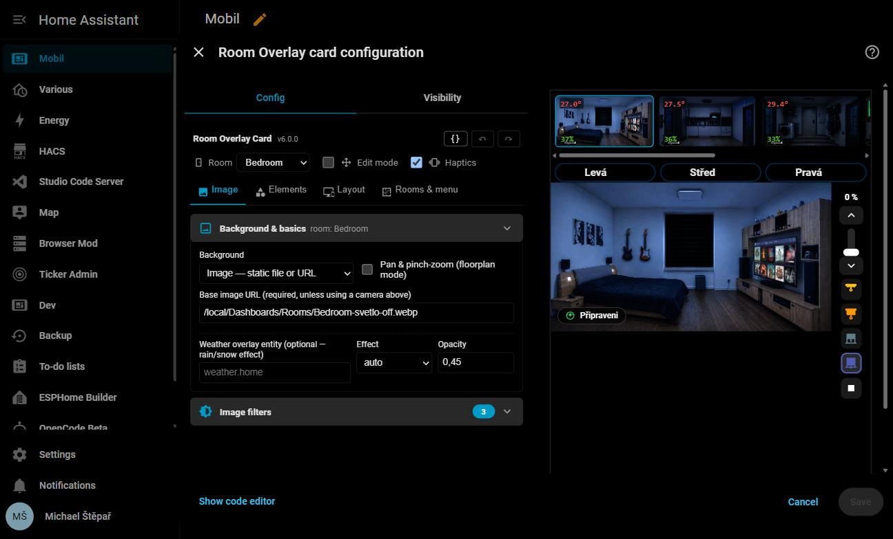

# Room Overlay Card

[](https://github.com/hacs/integration)
[](https://github.com/Michailjovic/Room-Card/releases/latest)
[](LICENSE)

A Home Assistant Lovelace card for **room visualization**. Take a photo of your room and bring it to life: dim it with the lights, place clickable controls on the furniture, show live sensor values, animate the blinds, and embed any other HA card on top of it.

**One card adapts to every screen** — you design two layout profiles (portrait / landscape) on a % grid of the viewport and every device picks the right one by its shape. Everything is configurable from a full tabbed GUI editor; you can build a whole card by dragging elements onto the image, no YAML required.


---

## Features at a glance

| Feature | What it does |
|---|---|
| **Layout profiles** | Two GUI-built % grid layouts (portrait / landscape) picked by the viewport's shape; per-device pinning via browser_mod |
| **Base image** | Any room photo, per-profile design aspect, cover/contain fit, configurable corner radius |
| **CSS filter engine** | Brightness, saturation, sepia, blur… driven by entity states with smooth transitions |
| **Brightness model** | Multi-stop filter interpolation: define stops (day / night / cinema…) and blend automatically |
| **Overlay layers** | Transparent PNG layers with conditional opacity/filter; state-driven image switching |
| **Gauges** | Animated progress bars in 6 fill directions, color gradients, per-gauge visibility |
| **Blinds** | Roller, venetian slat, and day/night (zebra) blind animations driven by cover entities, plus an icon-only cover controller |
| **Clickable zones** | Invisible hit areas — navigate, more-info, toggle, call-service, browser-mod popup |
| **Slider zones** | Drag across a zone to dim lights, move covers, set volume/temperature |
| **Status badges** | Floating chips in any corner — MDI icon, conditional color, conditional label |
| **Icons & labels** | State-aware MDI icons and entity/template text values placed anywhere |
| **Embedded HA cards** | Any card (tile, mini-graph, button…) placed at absolute coordinates |
| **Companion cards** | Full HA cards stacked above / below the image (great for mobile) |
| **Light controls** | A slider strip per light/switch, border colour tracking a lux sensor |
| **Camera & weather** | Live camera snapshot as the base layer; animated rain/snow overlay |
| **Multi-room** | One card for the whole home — define rooms, swipe & presence-follow |
| **Auto navigation menu** | The room switcher (thumbnails / tabs / dots) is generated automatically from your rooms — you never build the menu by hand |
| **Hold feedback** | A progress ring fills and turns green when a hold gesture registers |
| **Tabbed GUI editor** | Build everything visually — drag, resize, reorder — without writing YAML |

---

## Screenshots

| | |
|---|---|
|  |  |
| *One card, every screen — the same card at different widths* | *Tabbed GUI editor (v6.0.0) — build it without YAML, [full walkthrough with more screenshots](docs/EDITOR.md)* |
|  |  |
| *Day scene — full brightness* | *Night mode — dim filter active* |
|  |  |
| *Gauges — temperature, humidity, CO₂* | *Day/night zebra blind at 60 %* |
|  | |
| *Test mode — click to select, drag to position* | |

---

## Installation

### Via HACS (recommended)

1. Open **HACS → Frontend → ⋮ → Custom repositories**
2. Add `https://github.com/Michailjovic/Room-Card` — type **Lovelace**
3. Search for **Room Overlay Card** → Install
4. Hard-refresh your browser (`Ctrl+Shift+R`)

### Manual

1. Download `room-overlay-card.js` from the [latest release](https://github.com/Michailjovic/Room-Card/releases/latest)
2. Copy to `/config/www/room-overlay-card.js`
3. **Settings → Dashboards → ⋮ → Manage resources** → add `/local/room-overlay-card.js` (type: JavaScript module)
4. Hard-refresh

---

## Quick start (no YAML)

1. **Add the card** to a dashboard — *Add card → Custom: Room Overlay Card*.
2. The editor opens on a single step: **set a background image** (a room photo or floor-plan, e.g. `/local/bedroom.webp`). The rest of the editor appears once it's set.
3. Turn on **Edit mode** in the header. Now drag elements straight onto the image.
4. In the **Elements** tab, add an icon, label, zone or embedded card and drop it on the right spot.
5. Save. That's it — you never had to touch YAML.

The smallest possible card in YAML:

```yaml
type: custom:room-overlay-card
base_image: /local/images/bedroom.webp
aspect_ratio: "16/9"
```

---

## Documentation

This README is a landing page — the full reference lives here:

| Doc | What's in it |
|---|---|
| **[docs/CONFIGURATION.md](docs/CONFIGURATION.md)** | Every YAML key: layout grids, filters, overlays, gauges, blinds & cover control, zones, badges, icons/labels, embedded cards, light controls, multi-room, a complete example |
| **[docs/EDITOR.md](docs/EDITOR.md)** | The GUI editor tab by tab, Edit mode, and a summary of the editor UX rebuild that shipped in v5.9.0–v5.10.1 |
| **[LAYOUT.md](LAYOUT.md)** | Layout-engine implementation spec, for the curious or the contributing |
| **[PRESETS.md](PRESETS.md)** | Copy-paste recipes — day/night filters, weather moods, dimmer zones, door portals, presence multiroom |

---

## Development

`room-overlay-card.js` is the single source of truth — hand-maintained vanilla JS, no framework,
no source-file split. `npm run build` produces the minified release asset (terser, property
mangling off) that HACS installs; the repo itself stays readable and needs no build step to run
from a manual/local install.

```bash
npm test              # smoke + render + lifecycle tiers (node, jsdom)
npm run test:e2e       # Playwright geometry regression tests, real Chromium
npm run build           # build the minified dist/ bundle
npm run build:verify    # build, then run the full test suite against the minified bundle
```

---

## License

MIT © 2025–2026 Michailjovic
