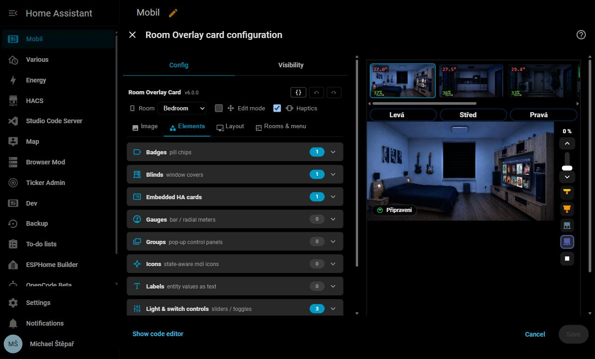
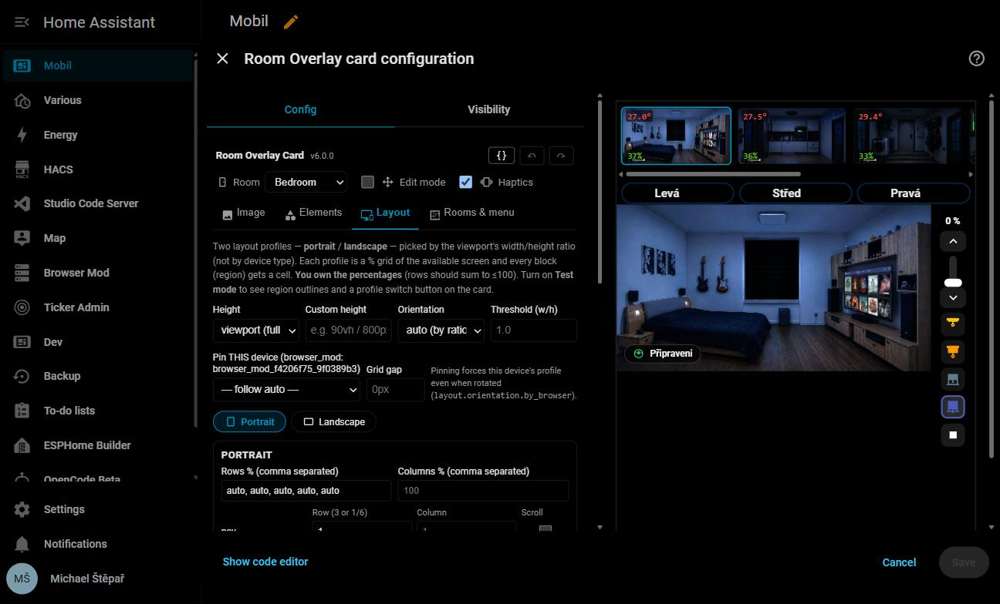
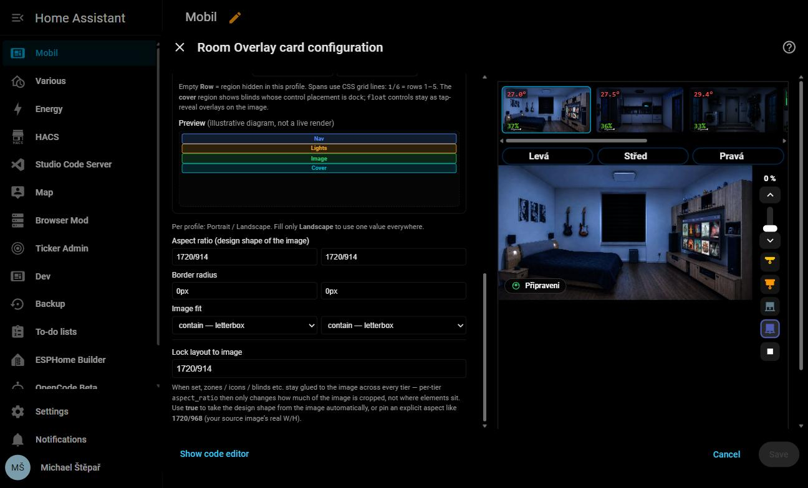
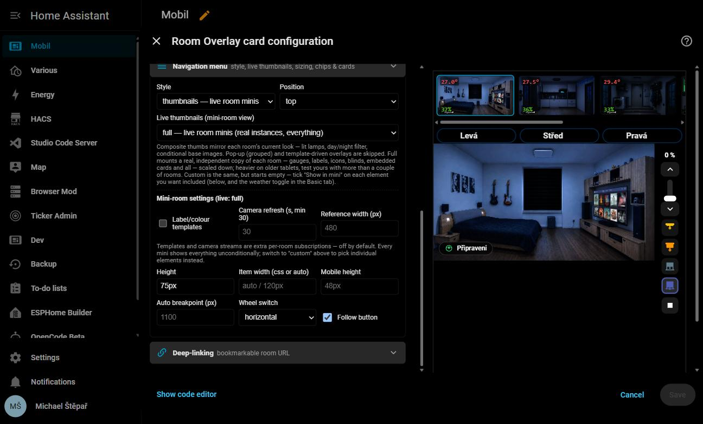

# Editor guide

[← Back to README](../README.md) · See also: [Configuration reference](CONFIGURATION.md) · [Preset gallery](../PRESETS.md)

The whole card can be built without writing YAML: add it, set a background, and everything else
happens by dragging on the image and filling in tabbed panels. This page walks through the
editor as it exists today, then summarizes the UX rebuild that got it here.

---

## Getting started

1. **Add the card** to a dashboard — *Add card → Custom: Room Overlay Card*.
2. The editor opens on a single step: **set a background image** (a room photo or floor-plan,
   e.g. `/local/bedroom.webp`) or a live camera. The rest of the editor appears once one is set —
   a narrow, unambiguous first step with no premature choices.
3. Turn on **Edit mode** in the header. Now drag elements straight onto the image.
4. In the **Elements** tab, add an icon, label, zone or embedded card and drop it on the right
   spot.
5. Save. You never had to touch YAML.

*The editor opens on the **Image** tab. `v6.0.0` next to the card name (top left) is the
installed version — check it here if something in this guide doesn't match what you see. The
panel on the right is a live, draggable preview of the room you're editing, not a static
mock-up.*

---

## Header (always visible)

- **Room picker** — when the card is multi-room, switches which room the *Image* and *Elements*
  tabs edit.
- **Edit mode** — see [below](#edit-mode).
- **Haptics** — feedback on actions (companion app) and hold-gesture registration.

## The four tabs

- **Image** — the background (image or camera), image-swap conditions, weather overlay, CSS
  filters, the brightness model, filter transition and zoom. Also the **companion cards** (above
  / below the image) and **light controls**.
- **Elements** — everything you place on the image: zones, icons, labels, badges, gauges,
  blinds, embedded cards, overlays, and groups. Each type is a collapsible section with a count,
  listed alphabetically (icons next to each label make it scannable without needing to reorder
  by intent).

  

  *A room with one badge, one blind, one embedded card, and three light controls — the badge
  next to each count (blue "1"/"3") is the quick way to see what a room actually uses without
  opening every section.*

- **Layout** — height source, orientation, threshold, and both profile grids as Portrait /
  Landscape sub-tabs, each with a live mini grid preview. See
  [Configuration → Layout](CONFIGURATION.md#layout--two-profiles-on-a--grid) for the underlying
  YAML.

  
  

  *Rows/columns as comma-separated percentages on the left; the coloured preview underneath
  (Nav / Lights / Image / Cover) redraws live as you type, so a typo that breaks the grid shows
  up immediately instead of on save.*

- **Rooms & menu** — four accordions: Room identity, Presence & follow, Navigation menu, and
  Deep-linking. Add / remove / reorder rooms here.

### Live navigation thumbnails (`nav.live`)

One of the more popular settings, and easy to miss: on the **Navigation menu** accordion, the
**Live thumbnails** dropdown controls whether the room-switcher thumbnails at the top of the card
are static images or living miniatures of each room.

- **off** — plain thumbnail images.
- **composite** — thumbnails layer in each room's currently-active overlays (lit lamps, open
  windows…) and its filters, so a dimmed room looks dimmed in the menu too. Cheap — pure CSS
  compositing, no extra card instances.
- **full** — every thumbnail is a real, independent mini `room-overlay-card` — gauges, labels,
  icons, badges, blinds, all of it, scaled down. Heaviest option; the *Mini-room settings* panel
  shown above lets you cap the cost (`Reference width`, `Camera refresh`, and whether
  label/colour templates subscribe at all).
- **custom** — same real-instance mechanism as `full`, but starts empty; you opt individual
  elements in with a "Show in mini" checkbox on their own panel. Use this when a room is too busy
  to look good shrunk down whole.

The underlying YAML (`nav.live`, `nav.mini.*`) is documented in
[Configuration → Multi-room](CONFIGURATION.md#multi-room-one-card--whole-home).

## Edit mode

`test_mode: true`, or the header toggle — same field, one name. Puts the card into a safe
editing state instead of its normal live behaviour: real tap/hold actions are suppressed, and
editing affordances appear — red outlines on zones, blue dashed outlines on embedded cards, a
live **viewport + active-profile badge**, region outlines with names, and a **profile switch
button**.

**Click an element to select it** — only the selected element shows resize handles, so the card
stays readable even with many overlapping elements. Drag to move (snaps to a 0.5 % grid,
magnetic alignment guides, hold **Alt** for free movement), drag a handle to resize, or nudge the
selection with the **arrow keys** (Shift = 0.1 %). Drag on an empty area to **draw a new zone**.

Because it's a saved config field, turning it on inside the editor also shows a **live,
draggable copy of the card right there in the header** (matching the room picked above — the
preview panel Home Assistant shows on the right is its own and follows live presence, so it
won't track the room picker), and — because it's saved — the same safe/draggable behaviour
carries over to the real card on your dashboard until you switch it off again.

The editor also has **undo/redo** (↶ ↷ or Ctrl+Z / Ctrl+Y).

---

## Editor UX rebuild (v5.9.0 – v5.10.1)

The control surface had grown a lot across v3–v4 and was getting hard to navigate, even for the
author. A full pass (analysis in `EDITOR_UX_REVALIDATION.md`, decided incrementally rather than
implemented wholesale) shipped four changes, all reflected in the walkthrough above:

- **Edit mode unified** (v5.9.0) — *Test mode* and *Drag-edit preview* used to be two separate
  controls doing overlapping things; they're now one header toggle with one meaning.
- **Layout tab got a live preview** (v5.9.11) — Portrait/Landscape used to be two stacked
  profile boxes with no visual feedback; now they're sub-tabs with an illustrative mini grid
  preview each, and edits actually reach the mounted Edit-mode preview card (previously they
  silently didn't).
- **Rooms & menu tab reorganized** (v5.9.13) — one long list split into four accordions (Room
  identity / Presence & follow / Navigation menu / Deep-linking), matching the pattern the
  Elements tab already used.
- **Dead control removed** (v5.10.1) — the blind editor's "Dock side" dropdown never affected
  anything (a docked control fills its grid region; there's no free space to align within), so
  it was removed rather than wired up to a knob that couldn't do anything.

Two proposals from the same review were **explicitly rejected** after discussion: reordering the
Elements sections by intent instead of alphabetically (the icons already make it scannable), and
a text filter/search per section (low value at typical room sizes — most rooms have a handful of
items per type).
